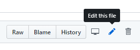
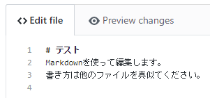
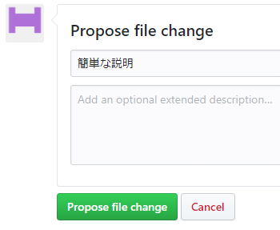
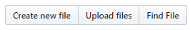
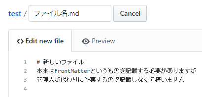
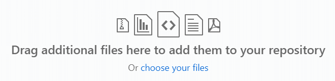
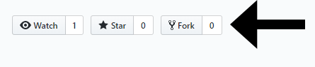
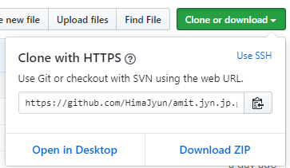
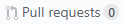

AMiTはGitHubでサイトを管理しており、ソースコードや編集履歴も閲覧可能です。

また、PullRequestなどを利用した編集も受け付けており、あなた自身の手でページを追加や編集ができます。

もちろんあなたの作った村を紹介するページを作成しても構いません。

<!--様子見
50行以上の編集を行ってくださった方には報酬としてスポーンエッグ全種セットをプレゼントしています。AMiTサーバーではスポーンエッグを入手できる仕組みがないため、非常に貴重なアイテムです。-->

ここではAMiTのWebサイトを編集する方法を説明します。

## 編集のやり方 (簡易版)
AMiTのWebサイトは次の技術で作られています。

- Git
- Hugo
- Markdown

Wikiなどの仕組みに比べるとやや上級者向けです。

初心者の方はGitHubの機能を最大限に活用して、簡単な使い方で試してみましょう。

失敗しても怒ったりしないので、いろいろ試してみてください。

### GitHubのアカウントを用意する
最初に、[GitHub](https://github.com/)のアカウントを作成しましょう。

アカウントを作成したら、このサイトを管理する[リポジトリ](https://github.com/HimaJyun/amit.jyn.jp)にアクセスしましょう。

いろいろなファイルをクリックしてみて、どこにどういう物があるのか確かめてみましょう。

ページは主に[content](https://github.com/HimaJyun/amit.jyn.jp/tree/master/content)ディレクトリに入っています。

### ページを編集する
編集したいページを見つけたら、それを開いて鉛筆のマークを探しましょう。  

クリックすると編集画面が開きます。気になる部分を書き換えましょう。  

変更を保存します。そのまま保存しても構いませんが、何をどのように変更したのか簡単な説明があるともっと良いでしょう。  

PullRequestを作成してください。  

PullRequestが作成されれば完了です。[PullRequestの一覧](https://github.com/HimaJyun/amit.jyn.jp/pulls)から自分のPullRequestが作成されているか確認しましょう。

管理人が編集内容を確認してサイトに反映するのでしばらくお待ちください。

### ページを作成する
先ほどは既存のファイルを編集する方法でしたが、もう一歩進んで新しいファイルを作成してみましょう。

「Create new file」を選択します。  

ファイル名やページの内容などを記載します。「Preview」でプレビューも確認できますよ。  

ファイル名には`.md`の拡張子を付けてください。また、スラッシュで区切るとディレクトリを作成できます。

ここから先は編集の時と同じです。コミット(保存して)PullRequest、とにかく基本はこの2つです。

### ファイルをアップロードする
慣れてくると画像が使いたくなってくるでしょう。そういう時はファイルのアップロード機能を使います。

「Upload files」を選択します。  

ファイルをアップロードしましょう。画像だけではなく、記事(Markdown)やディレクトリもそのままアップロードできます。  

後は編集の時と同じ、コミットしてPullRequest！

画像をアップロードする際には注意点があります。後述の「編集の時の注意点」をご覧ください。

### どうしても分からない時は
パソコンが苦手な人でも大丈夫です。

「このページに書いてあることがさっぱり分からない」という人はGitHub上で[issue](https://github.com/HimaJyun/amit.jyn.jp/issues)から編集内容を投稿してください。

管理人が対応します。

## 編集のやり方 (上級者向け)
ある程度コマンドなどの理解ができる人は上級者向けの編集方法も試してみましょう。

記事の都合もあるので簡単な説明にとどめています。分からない人は「Git 使い方」「GitHub PullRequest」「Markdown 書き方」「Hugo 使い方」などの単語で調べてみましょう。

もちろん簡易版のやり方で編集したのでも問題ありません。やっていることは同じです。

### 必要なもの
AMiTのWebサイトを編集するためには次の物が必要です。

- [Git](https://git-scm.com/downloads) (コマンドでの使い方を解説しますが、[Sourcetree](https://ja.atlassian.com/software/sourcetree)のようなGUIクライアントでも構いません)
- [Hugo](https://github.com/gohugoio/hugo/releases) (extended版が必要)
- Markdownに対応したエディター ([Visual Studio Code](https://azure.microsoft.com/ja-jp/products/visual-studio-code/)を推奨)
- ブラウザ ([Google Chrome](https://www.google.com/intl/ja/chrome/)を推奨)

### GitHubでforkしてcloneする
まずはこのサイトの[リポジトリ](https://github.com/HimaJyun/amit.jyn.jp)をforkしましょう。  

forkしたリポジトリから「Clone or download」ボタンを選択して、clone用のURLを取得しましょう。

通常は`https://github.com/<あなたのアカウント名>/amit.jyn.jp.git`になっているはずです。

このURLでcloneしましょう。コマンドからGitを使用する場合は`git clone <URL>`です。

`cd amit.jyn.jp`でcloneしたディレクトリに移動して、`git submodule init`と`git submodule update`を実行します。

これはテンプレートを初期化するコマンドです。

### 新しい記事を作成する
何を作業するときは、まずはコマンドのカレントディレクトリを移動する必要があります。

`cd <リポジトリのあるディレクトリ>`を実行して最初にディレクトリを移動しましょう。(Windowsの場合はShift+右クリックで「PowerShellウインドウをここで開く」を使用しても構いません)

`cd`で移動できたら、次は`hugo new ファイル名.md`で新しいファイルを作成しましょう。

作成したファイルをエディターで編集します。ちなみに編集中は`hugo server`でプレビューができるので活用しましょう。

### commitしてpushする
記事が作成できたらcommitしてpushしましょう。(本当はブランチを作成した方がいいのですが、説明が長くなるので省略)

`git add .`でファイルを追加した後に、`git commit -m "コミットメッセージ"`を実行してコミットします。

pushするには`git push origin master`を実行します。

### プルリクエストを作成する
GitHubの画面からフォークしたリポジトリを開いてPullRequestの一覧を表示します。  

「New pull request」を選択。  

PullRequestを作成してください。  

PullRequestが作成されれば完了です。[PullRequestの一覧](https://github.com/HimaJyun/amit.jyn.jp/pulls)から自分のPullRequestが作成されているか確認しましょう。

## 編集の時の注意点
編集の際にいくつか注意事項を。

多少は間違っていても構いません、こちらで修正するので気軽に編集に参加してください。

### ファイル名
各種ファイルは必ず英数小文字とハイフンで作成してください。

日本語などの含まれるファイルは正しく表示できない可能性があります。

### h2からはじめる
Markdownには`#`の数に応じてh1、h2……と見出しを付けられますが、記事はh2(`##`)で書き始めて、h1(`#`)は使わないようにしてください。

h1はページのタイトルに使われるためです。

### 画像のサイズ
画像は640x480pxのpngやjpegが無難なのでおススメです。

もちろんそれ以上大きくても構いませんが、大きすぎても意味がない事をお忘れなく。(スマホなどの画面幅が小さいデバイスでは画面幅に合わせて画像が小さくなります)

容量が大きくなるので適切な大きさに縮小してください。

### 画像の圧縮
画像を追加する際は必ず[TinyPNG](https://tinypng.com/)などで圧縮してから追加してください。

Photoshop CCなどをお持ちの方は「書き出し」を利用したのでも構いません。その際の推奨設定は以下の通りです。

PNG

- ファイルサイズ小(8-bit): 有効
- メタデータ: なし
- 色空間情報: sRGBに変換

JPG

- 画質: 80前後
- メタデータ: なし
- 色空間情報: sRGBに変換

## API
顔画像を取得するためのAPIがあります。

`https://amit.jyn.jp/api/headskin?user=ユーザー名`にアクセスするとユーザーの顔画像が取得できます。

PNG形式、48x48ピクセルです。imgでそのままページ内に貼り付けできます。

自己紹介やメンバーの一覧など使うと良いでしょう。

(APIはサイト内であれば自由に使って構いませんが、目的外の用途では利用しないでください)
